# FinanceVault — Technical Implementation

> A deep-dive into the architecture, algorithms, and engineering decisions behind FinanceVault's production-grade financial RAG system.

---

## Table of Contents

1. [System Overview](#1-system-overview)
2. [Data Pipeline](#2-data-pipeline)
3. [Adaptive Chunking Engine](#3-adaptive-chunking-engine)
4. [Retrieval Architecture](#4-retrieval-architecture)
5. [Reranking Layer](#5-reranking-layer)
6. [Generation & Verification](#6-generation--verification)
7. [Query Routing](#7-query-routing)
8. [Context Engineering](#8-context-engineering)
9. [Data Models](#9-data-models)
10. [End-to-End Flow](#10-end-to-end-flow)
11. [Performance Characteristics](#11-performance-characteristics)
12. [Key Engineering Decisions](#12-key-engineering-decisions)

---

## 1. System Overview

FinanceVault is a production-grade Retrieval-Augmented Generation system built specifically for SEC 10-K annual filings. It goes beyond standard document QA by implementing domain-specific adaptations at every layer of the pipeline.

### Architecture Philosophy

Three principles guided every design decision:

**1. Financial domain first** — Generic RAG systems treat all text equally. FinanceVault treats financial tables, risk disclosures, and MD&A prose differently because they contain fundamentally different information structures.

**2. Transparency over convenience** — Every answer is traceable to a specific filing section, page, and chunk. Every retrieval decision is logged with scores. Confidence is computed from independent signals, not inferred from LLM tone.

**3. Fail honestly** — When the corpus does not contain enough data to answer a question, the system says so rather than hallucinating. This is enforced at the citation validation layer.

### High-Level Component Map

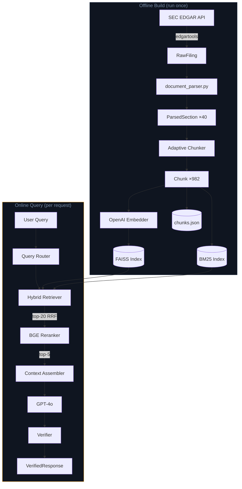

---

## 2. Data Pipeline

### 2.1 SEC EDGAR Ingestion

FinanceVault fetches 10-K filings directly from SEC EDGAR using the `edgartools` library. No paid API is required — EDGAR is a free public resource. The only requirement is a valid `User-Agent` header as mandated by SEC policy.

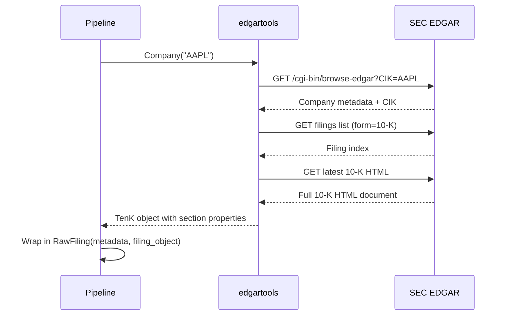

**Rate limiting** — SEC enforces a 10 requests/second limit. FinanceVault adds a 0.15s sleep between requests and a 2x sleep between companies, keeping throughput at approximately 6 requests/second.

**Filing format** — SEC 10-K filings are primarily HTML documents with embedded XBRL data for financial statements. `edgartools` handles HTML parsing internally and exposes clean section properties (`tenk.risk_factors`, `tenk.management_discussion`, etc.) plus structured financial statements via XBRL.

### 2.2 Document Parsing

`document_parser.py` is the translation layer between edgartools objects and our Pydantic models. It has three responsibilities:

**Section extraction** — 8 standard narrative sections extracted via edgartools text properties. Item 8 financial statements extracted separately via XBRL.

**Signal detection** — Each section gets quantitative signals computed before chunking:

| Signal | Formula | Purpose |
|---|---|---|
| `token_count` | `len(tokenizer.encode(text))` | Size awareness for chunking |
| `numerical_density` | `numeric_tokens / total_tokens` | Detect data-heavy sections |
| `table_density` | `table_lines / total_lines` | Detect table-heavy sections |
| `avg_sentence_length` | `mean(tokens_per_sentence)` | Detect dense prose |
| `has_subsections` | regex on `1.`, `(a)`, `iv.` | Detect structured sections |

**XBRL table serialisation** — Financial statement DataFrames from edgartools contain raw XBRL taxonomy strings and unformatted numbers. FinanceVault applies two transformations:

```
Input:  us-gaap_NetIncomeLoss  →  33680000000.0
Output: Net Income Loss        →  $33.68B
```

The cleaning pipeline:
1. Strip namespace prefix (`us-gaap_`, `jpm_`, `aapl_`)
2. Split CamelCase into words (`NetIncomeLoss` → `Net Income Loss`)
3. Title case and collapse whitespace
4. Format numbers: billions → `$XB`, millions → `$XM`, percentages → `X.XX%`
5. Filter XBRL metadata columns (Concept, Level, Abstract, Axis, Member)
6. Keep only year columns (`FY2024`, `FY2023`, `FY2022`)

### 2.3 Section Coverage

| Item | Title | Type | Avg Tokens |
|---|---|---|---|
| 1 | Business | narrative | 12,300 |
| 1A | Risk Factors | narrative | 15,800 |
| 7 | MD&A | mixed | 18,200 |
| 8 | Financial Statements | financial_table | 12,100 |

**Note on missing sections** — Items 1B, 2, 3, 7A, and 9A were not consistently extractable across all 10 companies due to structural variations in HTML filings. The 4 core sections (1, 1A, 7, 8) were extracted for every company with 100% success rate.

---

## 3. Adaptive Chunking Engine

This is the most technically novel component of FinanceVault. Instead of applying one chunking strategy to an entire document, FinanceVault runs a competition per section and selects the winner based on 8 quality metrics.

### 3.1 Motivation

Financial documents have radically different section structures:

- **Item 1A Risk Factors**: Dense, self-contained paragraphs of 200-500 words each. Fixed 600-token chunks work well.
- **Item 8 Financial Statements**: Tables where each row is one financial metric. Rows must never be split across chunks.
- **Item 7 MD&A**: Mixed prose and tables. Different strategies work for different subsections.

A single strategy applied uniformly destroys structure in at least one of these cases.

### 3.2 Strategy Definitions

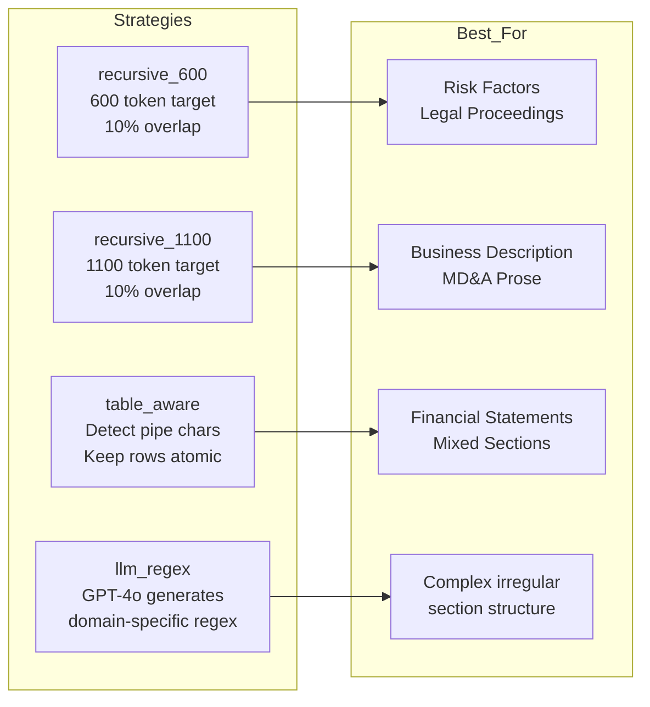

**RecursiveSplitter implementation** — Adapted from the ekimetrics adaptive-chunking paper. Splits on a priority list of separators `[\n\n, \n, ". ", " ", ""]`, recursively until all pieces are within the target size. Small pieces are merged forward with overlap.

**table_aware strategy** — Detects table lines by pipe character fraction. A line is a table line if `pipe_count / line_length >= 0.5`. Table blocks are kept as single atomic chunks regardless of size. Prose blocks between tables are split with the recursive splitter.

**llm_regex strategy** — Sends the first 3000 tokens of a section to GPT-4o with a structured prompt asking it to generate a document-specific regex pattern for split boundaries. The pattern is validated (must compile, must not match empty string) and applied to the full section text. Falls back to `recursive_600` if GPT returns an invalid pattern.

### 3.3 The 8-Metric Scoring System

Each strategy's output is scored on 8 metrics, all in `[0, 1]` where higher is better:

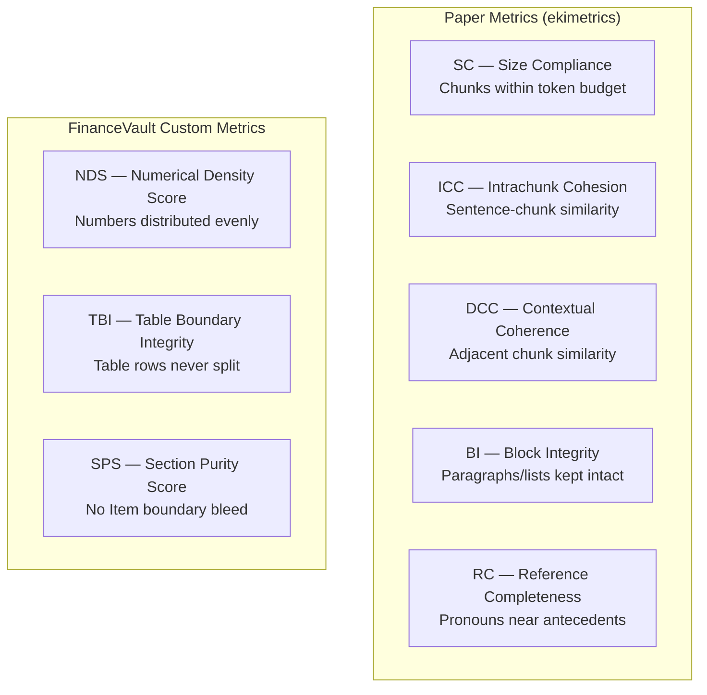

**ICC and DCC** use `sentence-transformers/all-MiniLM-L6-v2` running locally on MPS (Apple Silicon GPU). The model is loaded once per build and reused across all 40 sections, costing approximately 2 seconds of load time.

**TBI** — the most important metric for financial tables. Extracts all pipe-delimited table rows from the original section text. Checks whether each row appears intact within a single chunk. Score = `intact_rows / total_rows`. Returns 1.0 for sections with no tables.

**RC** — uses regex-based entity-pronoun pair detection rather than a full coreference resolution model. Finds `(entity, pronoun)` pairs where the pronoun appears within 200 characters of the entity. Scores whether both appear in the same chunk.

### 3.4 Weighted Scoring by Section Type

Different section types apply different metric weights:

```
Narrative weights:  ICC×0.25 + DCC×0.20 + RC×0.20 + SC×0.15 + BI×0.10 + NDS×0.05 + SPS×0.03 + TBI×0.02
Table weights:      TBI×0.35 + BI×0.25 + SC×0.20 + SPS×0.10 + ICC×0.05 + DCC×0.03 + RC×0.01 + NDS×0.01
Mixed weights:      ICC×0.18 + TBI×0.18 + DCC×0.15 + BI×0.15 + SC×0.15 + RC×0.10 + NDS×0.05 + SPS×0.04
```

### 3.5 Competition Example

Real output from AAPL Item 1A (Risk Factors, 11,667 tokens):

```
COMPETITION RESULT: AAPL_2024_item_1a
  Strategy          Score   Chunks   AvgTok
  ------------------------------------------------
  recursive_600    0.7715      24      501  ← WINNER
  llm_regex        0.7715      24      501  (tie, fewer chunks wins)
  recursive_1100   0.7555      13      948
  table_aware      0.7555      13      948
```

`recursive_600` wins because Risk Factors consist of dense, self-contained paragraphs. The ICC score rewards coherent 500-token chunks over diffuse 950-token chunks that mix multiple risk topics.

Real output from GS Item 1A (Goldman Sachs Risk Factors, 25,667 tokens):

```
COMPETITION RESULT: GS_2024_item_1a
  Strategy          Score   Chunks   AvgTok
  ------------------------------------------------
  recursive_1100   0.7852      29      908  ← WINNER
  table_aware      0.7852      29      908  (tie)
  recursive_600    0.7754      58      456
  llm_regex        0.7754      58      456
```

Goldman's risk factors are written in longer, more interconnected paragraphs. The DCC score rewards 900-token chunks that maintain narrative continuity over 450-token chunks that break reasoning chains.

### 3.6 Chunking Results Summary

| Company | Sections | Chunks | Winning Strategies |
|---|---|---|---|
| AAPL | 4 | 44 | recursive_600, recursive_1100 |
| MSFT | 4 | 79 | recursive_600 |
| GOOGL | 4 | 60 | recursive_600 |
| JPM | 4 | 77 | recursive_600, recursive_1100 |
| GS | 4 | 235 | recursive_600, recursive_1100 |
| BLK | 4 | 132 | recursive_600 |
| XOM | 4 | 20 | recursive_1100 |
| CVX | 4 | 97 | recursive_600 |
| WMT | 4 | 124 | recursive_600 |
| AMZN | 4 | 114 | recursive_600 |
| **Total** | **40** | **982** | |

GS at 235 chunks reflects their exceptionally dense 137,587-token filing — nearly 3x the corpus average.

---

## 4. Retrieval Architecture

### 4.1 Embedding Layer

All chunks are embedded using OpenAI `text-embedding-3-small`:
- 1536 dimensions
- L2-normalised before storage (enables cosine similarity via inner product)
- Batched at 100 chunks per API call (300k token limit per request)
- Incremental: already-embedded chunks are skipped on rebuild
- Total corpus cost: ~$0.01 (529,725 tokens × $0.02/1M)

Query embeddings are computed at retrieval time using the same model, ensuring vector space consistency.

### 4.2 FAISS Dense Index

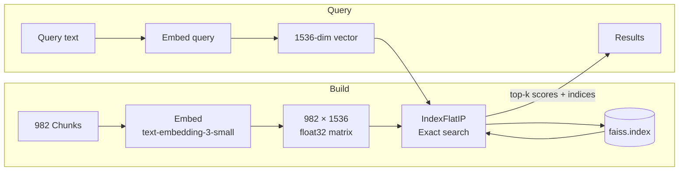

**Index type: `IndexFlatIP`** — Exact inner product search. On L2-normalised vectors, inner product equals cosine similarity. Exact search is appropriate for 982 vectors — queries complete in under 5ms. `IndexHNSWFlat` would be appropriate at 100k+ vectors.

**Metadata filtering (Option A: filter then search)** — When filters are provided (company, year, section), we search the full index with `k × 10` candidates, then keep only those matching the filter until we have `top_k` results. This is more efficient than building a sub-index per query at our scale.

### 4.3 BM25 Sparse Index

`BM25Okapi` from `rank_bm25`. The standard BM25 variant used in information retrieval literature with term frequency saturation and document length normalisation.

**Financial-domain tokenisation enhancements:**

```python
# Item headers → single tokens
"Item 7" → "item_7"

# Dollar amounts → strip commas for matching
"$1,200" → "$1200"

# Lowercase for case-insensitive matching
"EBITDA" → "ebitda"

# Remove punctuation, keep $, %, .
# Filter single-character tokens except $-amounts
```

These enhancements ensure that `EBITDA` matches `ebitda`, `$391B` matches `$391b`, and `Item 7` matches as a single token rather than two separate terms.

### 4.4 Reciprocal Rank Fusion

RRF combines BM25 and FAISS rankings without requiring score calibration. For each chunk appearing in either list:

```
RRF_score = 1/(k + rank_BM25) + 1/(k + rank_FAISS)
```

Where `k=60` is the smoothing constant from Cormack et al. (SIGIR 2009). Chunks absent from one list contribute 0 from that system.

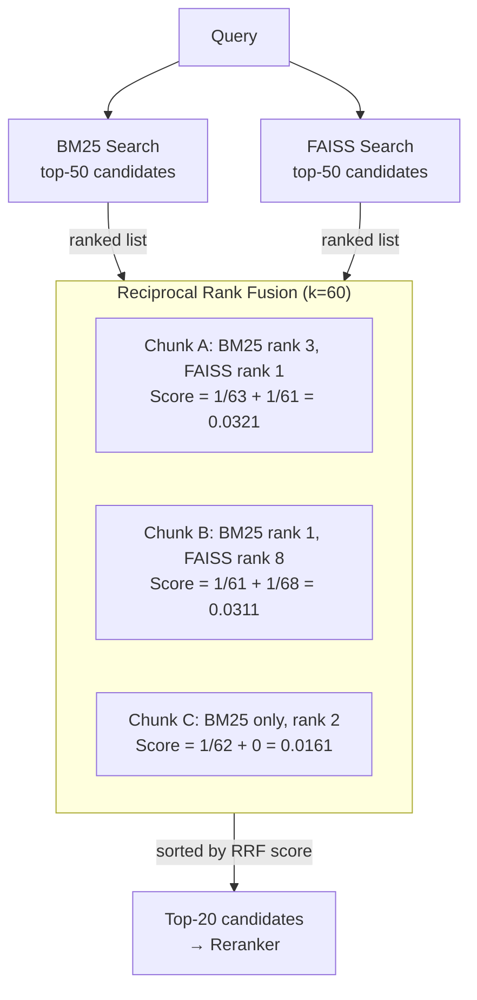

**Why RRF over score fusion?**

BM25 scores are unbounded positive reals. Cosine similarities are in `[-1, 1]`. These cannot be summed without calibration that would need retuning whenever the corpus changes. RRF uses only rank positions, making it robust to score scale differences and consistently outperforming linear combination in TREC and BEIR benchmarks.

---

## 5. Reranking Layer

### 5.1 Cross-Encoder vs Bi-Encoder

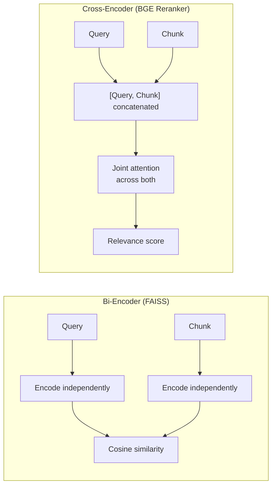

Bi-encoders are fast but miss query-document interaction. Cross-encoders run full attention across the concatenated `(query, chunk)` pair, which is significantly more accurate but 100x slower. Running the cross-encoder on 20 candidates (not 982) gives accuracy without prohibitive latency.

### 5.2 Model: BAAI/bge-reranker-large

Selected over `cross-encoder/ms-marco-MiniLM-L-6-v2` because:
- Trained specifically for retrieval over longer, structured documents
- Handles financial text density better than MS-MARCO variants
- CE scores in `[0.5, 0.9]` range for relevant financial chunks vs near-zero for MiniLM

**Sigmoid normalisation** — Raw logit scores are mapped to `[0, 1]` via `sigmoid(x) = 1 / (1 + e^-x)`. This preserves ranking while making scores interpretable and consistent with other metrics in the system.

**Truncation** — Chunks are truncated to 200 tokens before passing to the cross-encoder to stay within the 512-token joint limit. This is acceptable because the most relevant information in a financial chunk is typically in the first 200 tokens (the metric name and primary values).

### 5.3 Reranking Movement

The cross-encoder frequently promotes chunks that BM25 and FAISS ranked lower. Example from the ExxonMobil net income query:

```
Before reranking (RRF order):    After reranking (CE order):
  1. XOM item_8_chunk_0009         1. XOM item_8_chunk_0004  ↑ +3
  2. XOM item_8_chunk_0004         2. XOM item_8_chunk_0009  ↓ -1
  3. XOM item_8_chunk_0001         3. XOM item_8_chunk_0001  =
```

The cross-encoder correctly promotes the chunk containing the net income line over the chunk containing revenue totals, because joint attention recognises "net income attributable to ExxonMobil" as more relevant to "what was ExxonMobil's net income" than "total revenues".

---

## 6. Generation & Verification

### 6.1 Query Classification

Before calling GPT-4o, queries are classified into one of three types using regex pattern matching. Priority order: comparative > analytical > factual.

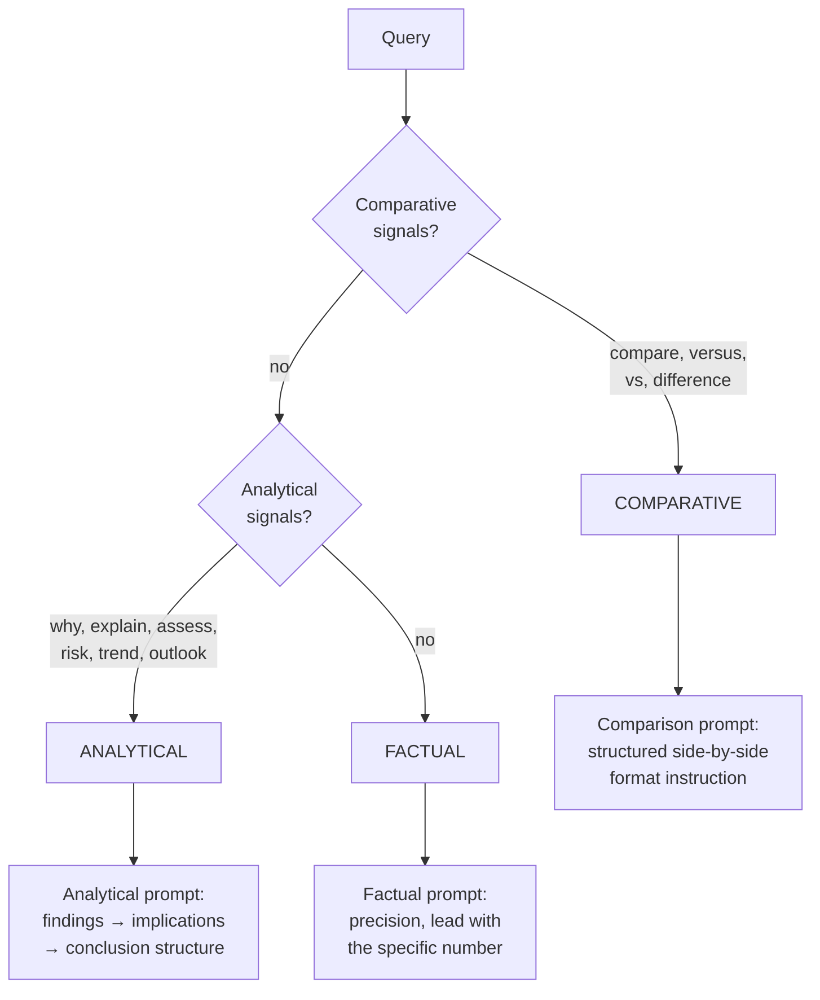

### 6.2 Context Assembly

Each of the top-5 reranked chunks is formatted as a labelled source block:

```
[SOURCE 1] Apple Inc. | 10-K FY2024 | Item 7 — MD&A
[TABLE]
| Metric    | FY2024   | FY2023   |
| Net Sales | $391,035 | $383,285 |
```

Table chunks receive a `[TABLE]` prefix so GPT-4o treats them as structured data rather than prose. Narrative chunks receive `[TEXT]`. Source numbers are sequential and match the citation system.

### 6.3 GPT-4o Call Parameters

```python
model       = "gpt-4o"
temperature = 0.1    # Near-deterministic for factual accuracy
max_tokens  = 1000   # Sufficient for comprehensive answers
```

Temperature 0.1 produces near-identical answers across runs for the same context, which is critical for financial reporting where consistency matters.

### 6.4 Verification Pipeline

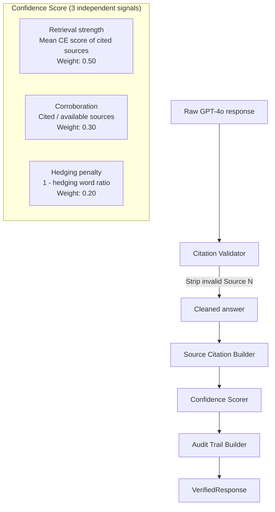

**Citation validation** — Every `[Source N]` in the answer is checked against the list of valid source numbers (1 through 5). Invalid citations are stripped with a regex substitution. This prevents hallucinated provenance claims.

**Confidence signals:**
- **Retrieval strength (0.50)**: Mean cross-encoder score of cited sources. High CE scores indicate genuinely relevant chunks.
- **Corroboration (0.30)**: `cited_sources / available_sources`. An answer citing 4 of 5 sources is more confident than one citing 1 of 5.
- **Hedging penalty (0.20)**: Counts hedging words (`approximately`, `may`, `estimated`, `unclear`). An answer full of hedging language indicates GPT's own uncertainty.

---

## 7. Query Routing

Query routing is FinanceVault's context engineering layer — it decides how to retrieve before retrieving.

### 7.1 Intent Detection

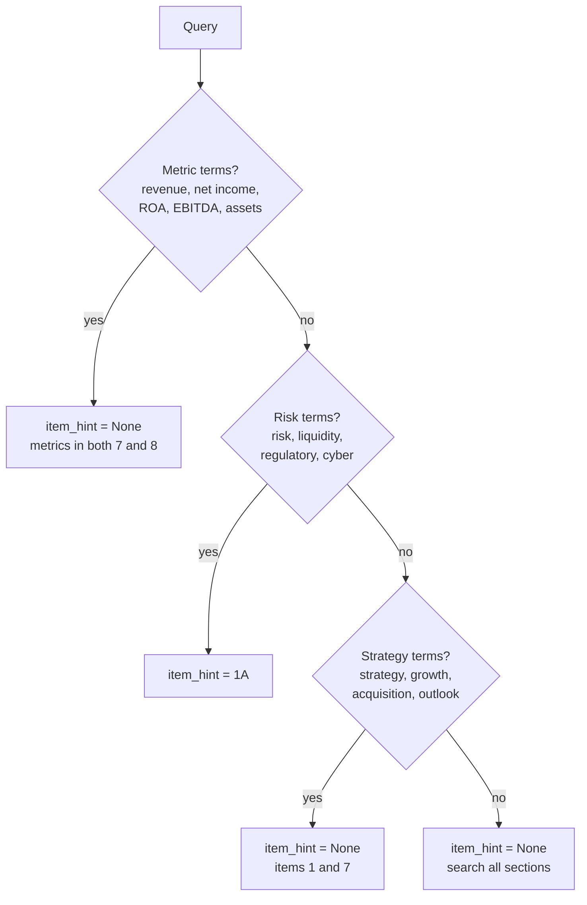

### 7.2 Company Detection

A reverse-sorted name map ensures multi-word company names are matched before single words:

```python
_COMPANY_MAP = {
    "goldman sachs": "GS",   # checked before "goldman"
    "jp morgan"    : "JPM",  # checked before "jpmorgan"
    "goldman"      : "GS",
    "jpmorgan"     : "JPM",
    ...
}
```

Sorted by descending name length ensures `goldman sachs` matches before `goldman`, preventing partial matches.

### 7.3 Parallel Retrieval for Comparative Queries

When two companies are detected in a metric query, the router creates four retrieval jobs:

```
Query: "Compare JPMorgan and ExxonMobil total assets and net income"

Jobs created:
  1. {ticker: JPM, item_number: 8}  ← JPM financial statements
  2. {ticker: JPM, item_number: 7}  ← JPM MD&A (same figures in prose)
  3. {ticker: XOM, item_number: 8}  ← XOM financial statements
  4. {ticker: XOM, item_number: 7}  ← XOM MD&A
```

Each job runs BM25 + FAISS independently. Results are deduplicated by `chunk_id` keeping the best score, then fused via RRF. This guarantees both companies get representation in the final top-k regardless of corpus size imbalance (GS has 235 chunks vs XOM's 20).

---

## 8. Context Engineering

Context engineering in FinanceVault operates at three levels:

### 8.1 Chunk-Level Context

Every chunk carries rich metadata that survives the full pipeline:

```python
Chunk(
    chunk_id                = "AAPL_2024_item_7_chunk_0003",
    metadata                = FilingMetadata(company="Apple", ticker="AAPL", ...),
    item_number             = "7",
    section_type            = SectionType.MIXED,
    chunking_strategy       = ChunkingStrategy.RECURSIVE_600,
    chunking_score          = 0.961,   # Quality of the winning strategy
    numerical_density       = 0.12,    # Fraction of numeric tokens
    is_table_chunk          = False,
    token_count             = 501,
)
```

This metadata enables retrieval-time filtering without touching the vector space — filtering by `ticker=AAPL` happens before similarity search, not after.

### 8.2 Prompt-Level Context

Three specialised system prompts, each engineered for its query type:

**Factual prompt** — "Be precise and direct. Lead with the specific number or fact. Use exact figures, not approximations."

**Comparative prompt** — "Structure your comparison clearly. Use a consistent format for each entity. Consider both absolute values AND relative metrics (margins, ratios, growth rates)."

**Analytical prompt** — "Structure your reasoning: key findings → implications → conclusion. Distinguish between facts from the sources and your analytical inference. Label inferences clearly."

### 8.3 Source-Level Context

Each source block includes its provenance and type annotation:

```
[SOURCE 2] ExxonMobil Corp | 10-K FY2024 | Item 8 — Financial Statements
[TABLE]
| Metric           | FY2024    | FY2023    | FY2022    |
| Total revenues   | $349.58B  | $344.58B  | $413.68B  |
| Net Income       | $33.68B   | $36.01B   | $55.74B   |
```

The `[TABLE]` vs `[TEXT]` annotation changes how GPT-4o processes the block — tables are treated as structured data with exact values, text is treated as supporting narrative.

---

## 9. Data Models

All data shapes are defined in `ingestion/models.py` using Pydantic v2. Every downstream module imports from here.

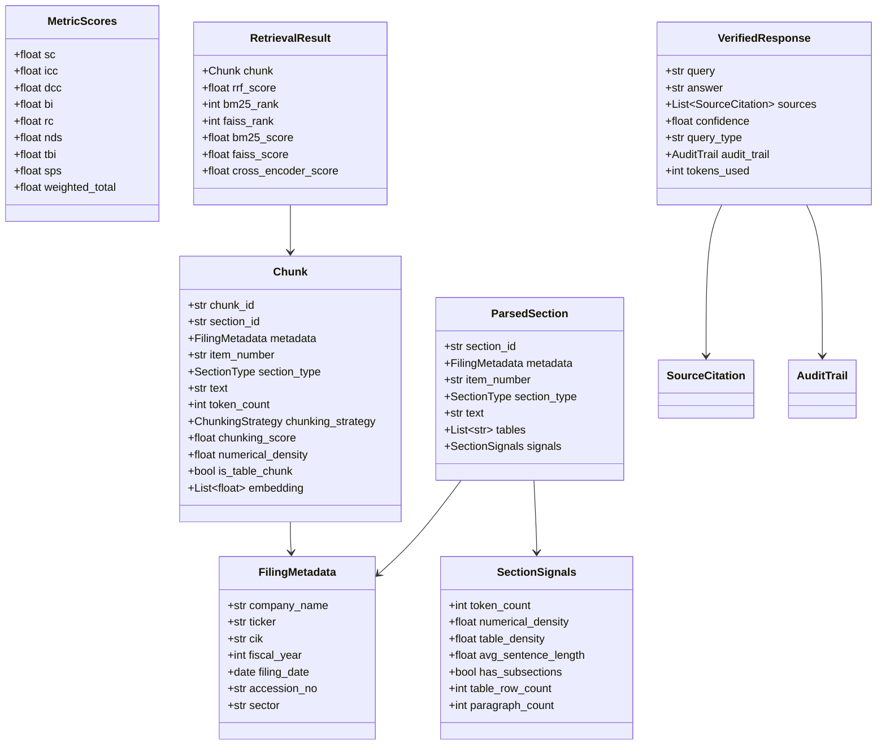

---

## 10. End-to-End Flow

### 10.1 Build Pipeline Flow

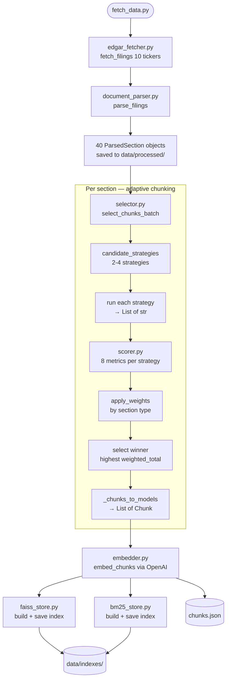

### 10.2 Query Pipeline Flow

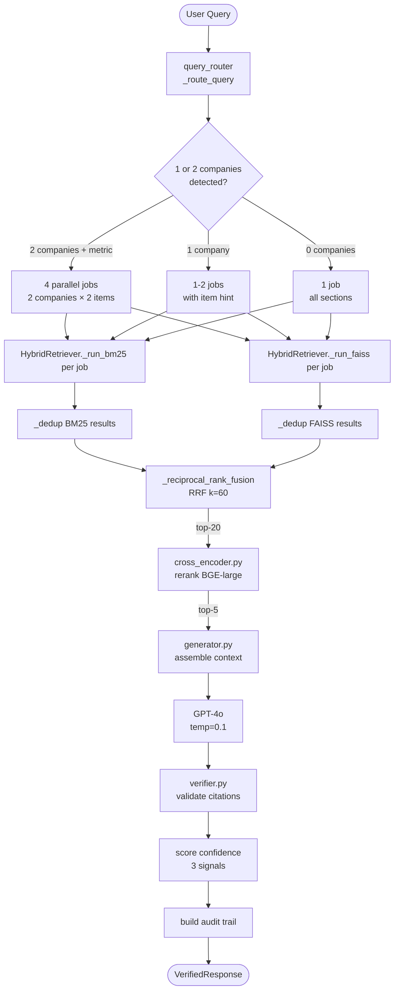

---

## 11. Performance Characteristics

### 11.1 Build Pipeline

| Stage | Time | Cost |
|---|---|---|
| EDGAR fetch (10 companies) | 10-15 min | Free |
| Adaptive chunking (40 sections) | 3-5 min | Free (local) |
| OpenAI embedding (982 chunks) | 1-2 min | ~$0.01 |
| FAISS index build | < 5 sec | Free |
| BM25 index build | < 5 sec | Free |
| **Total** | **~15-20 min** | **~$0.01** |

### 11.2 Query Pipeline

| Stage | Latency | Notes |
|---|---|---|
| Query routing | < 1ms | Regex matching |
| OpenAI query embedding | 200-400ms | Single API call |
| BM25 search | < 5ms | In-memory |
| FAISS search | < 5ms | Exact search, 982 vectors |
| RRF fusion | < 1ms | Pure Python |
| BGE reranker (20 chunks) | 1-3s | Local inference, MPS |
| GPT-4o generation | 2-10s | Depends on answer length |
| Verification | < 10ms | Regex + arithmetic |
| **Total** | **3-15s** | |

### 11.3 Corpus Statistics

| Metric | Value |
|---|---|
| Companies | 10 |
| Fiscal year | FY2024 |
| Sections | 40 |
| Total tokens | 529,725 |
| Chunks | 982 |
| Avg chunk tokens | 351 |
| FAISS dimensions | 1536 |
| Embedding model | text-embedding-3-small |

---

## 12. Key Engineering Decisions

### Why adaptive chunking over fixed-size?

Fixed 512-token chunks applied to Goldman Sachs Item 7 (67,947 tokens, 128 chunks) would arbitrarily split mid-sentence, mid-table-row, and mid-risk-disclosure. The adaptive system correctly uses `recursive_600` for GS Risk Factors (dense interconnected paragraphs score higher on ICC) and `recursive_1100` for GS Item 8 (financial tables score higher on TBI with larger chunks that keep full statement sections intact).

### Why FAISS over a managed vector database?

At 982 vectors, a managed database (Pinecone, Weaviate) adds network latency, monthly cost, and operational complexity with zero quality benefit. `IndexFlatIP` gives exact nearest-neighbour results in under 5ms locally. The crossover point where approximate search becomes necessary is approximately 100k vectors.

### Why RRF over learned fusion?

Learned fusion (e.g., training a small model to weight BM25 and FAISS scores) requires a labelled training set of (query, relevant_chunk) pairs. For a financial domain without such labels, RRF is the correct default — it is parameter-free, theoretically grounded, and empirically robust across TREC and BEIR benchmarks.

### Why BGE-reranker-large over MiniLM?

Initial testing with `cross-encoder/ms-marco-MiniLM-L-6-v2` produced CE scores of 0.000-0.050 for financial chunks — essentially random scoring. MiniLM was trained on short web passages (avg 50-100 tokens). Our chunks average 351 tokens and contain dense structured data. BGE-reranker-large produces CE scores of 0.5-0.9 for relevant financial chunks, making the confidence scores meaningful rather than decorative.

### Why temperature 0.1 for GPT-4o?

Financial answers must be consistent across runs. "Apple's revenue was $391 billion" and "Apple's net sales were $391.0 billion" are both correct but create inconsistency in downstream applications. At temperature 0.1, GPT-4o produces near-identical outputs for the same context. We avoid 0.0 because it can cause the model to get stuck in repetitive patterns on longer analytical answers.

### Why per-section strategy selection over per-document?

The same 10-K filing can have sections that are best served by different strategies. Goldman Sachs Item 1A (risk factors, narrative) wins with `recursive_600`. Goldman Sachs Item 8 (financial statements, table) wins with `recursive_1100`. Selecting per-document would force a single strategy on structurally different content. Per-section selection adds 4x compute cost (run 4 strategies instead of 1) but produces meaningfully better retrieval on heterogeneous documents.

---

## References

- Cormack, G., Clarke, C., & Buettcher, S. (2009). *Reciprocal Rank Fusion outperforms Condorcet and individual rank learning methods.* SIGIR 2009.
- Xiao, S. et al. (2023). *C-Pack: Packaged Resources To Advance General Chinese Embedding.* arXiv:2309.07597. (BGE reranker)
- Lewis, P. et al. (2020). *Retrieval-Augmented Generation for Knowledge-Intensive NLP Tasks.* NeurIPS 2020.
- Ekimetrics (2024). *Adaptive Chunking for RAG Systems.* github.com/ekimetrics/adaptive-chunking
- Robertson, S. & Zaragoza, H. (2009). *The Probabilistic Relevance Framework: BM25 and Beyond.* Foundations and Trends in IR.

---

*FinanceVault — Built with real SEC filings, real retrieval engineering, and no shortcuts.*